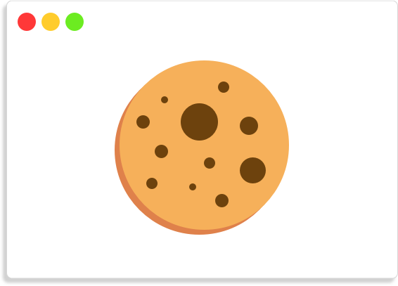

<!-- PROJECT LOGO -->
<br />
<p align="center">
  <a href="https://github.com/MaxiMittel/cookie-popup">
    
  </a>
  <h3 align="center">Cookie Popup</h3>

  <p align="center">
    <br />
    <a href="https://jsfiddle.net/MaxiMittel/uavrwmdc/22/">View Demo</a>
    ·
    <a href="https://github.com/MaxiMittel/cookie-popup/issues">Report Bug</a>
    ·
    <a href="https://github.com/MaxiMittel/cookie-popup/issues">Request Feature</a>
  </p>
</p>


<!-- USAGE EXAMPLES -->
## Usage

Add the script below to the head tag of your website.
```html
<script src="https://cdn.jsdelivr.net/gh/MaxiMittel/cookie-popup/popup.min.js"></script>
```

To configure and show the popup add the code below to your website. You can find more information about the configuration below.

```js
let config = {
    header: "This site contains cookies",
    //Rest of your configuration
};

window.onload = function() {
    let popup = new CookiePopup(config);
}
```

_An full example can be found on [JSFiddle](https://jsfiddle.net/MaxiMittel/uavrwmdc/22/)_

<!-- CONTRIBUTING -->
## Configuration

| name            | type                        | description                                                                                                                     |
|-----------------|-----------------------------|---------------------------------------------------------------------------------------------------------------------------------|
| `heading`         | `string`                      | The heading of your cookie popup.                                                                                               |
| `informationText` | `string`                      | Will be displayed below your heading and should give the user a short description what cookies are and why they are required.   |
| `checkboxes`      | `Array<CheckboxItem> `        | Define what cookie categories the user will be able to opt in/out of. More information about the type CheckboxItem below.       |
| `buttons`         | `Array<ButtonItem>`          | Define what predefined checkbox combinations the user will be able to select. More information about the type ButtonItem below. |
| `tableHeads`      | `Array<string>`               | Headings for the columns of the service table. (service table is defined in CheckboxItem)                                       |
| `callback`        | `(res: ResultObject) => void` | This function will be called after the user made a selection.                                                                   |
| `style`           | `string`                      | Provide your own stylesheet. Will default to the "popup.css" file.                                                              |

### CheckboxItem
| name        | type                 | description                                                                                                                                     |
|-------------|----------------------|-------------------------------------------------------------------------------------------------------------------------------------------------|
| `title`       | `string`               | The label for the checkbox.                                                                                                                     |
| `required`    | `boolean`              | If true the checkbox will be disabled and set to true otherwise it will have the value of the checked attribute below.                          |
| `checked`     | `boolean`              | Determines the default value of the checkbox.                                                                                                   |
| `name`        | `string`               | Choose a descriptive and unique name for this cookie category.                                                                                  |
| `description` | `string`               | A short description of the intended use of these cookies.                                                                                       |
| `services`    | `Array<Array<string>>` | Provide information about the used cookies. NOTE: Length of the inner list must be equal to the length of the attribute tableHead in the config |

### ButtonItem
| name    | type       | description                                                                                                  |
|---------|------------|--------------------------------------------------------------------------------------------------------------|
| `title`   | `string`     | The text inside the button.                                                                                  |
| `onclick` | `() => void` | Define the onclick behaviour of the button. Use `check` and `uncheck` functions the define checkbox presets. |
| `green`   | `boolean`    | If true button will be depicted in green otherwise in default color.                                         |

<!-- OTHER FUNCTIONS -->
## Presets
As mentioned in the configuration above you can define checkbox presets, you would usually do this in a `ButtonItem` with the functions `check` and `uncheck`. Both functions take an undefined amount of arguments of type `string` with names (defined in `CheckboxItem`) of cookie categories. **NOTE: Names must be unique.**

```js
let buttonItem = {
    title: "Only necessary",
    onclick: () => {
        check("necessary");
        uncheck("marketing", "location")
    }
}
```

<!-- CONTRIBUTING -->
## Contributing

Contributions are what make the open source community such an amazing place to be learn, inspire, and create. Any contributions you make are **greatly appreciated**.

1. Fork the Project
2. Create your Feature Branch (`git checkout -b feature/AmazingFeature`)
3. Commit your Changes (`git commit -m 'Add some AmazingFeature'`)
4. Push to the Branch (`git push origin feature/AmazingFeature`)
5. Open a Pull Request


<!-- LICENSE -->
## License

Distributed under the MIT License. See `LICENSE` for more information.


<!-- CONTACT -->
## Contact

Maximilian Mittelhammer - [@maxi_maximittel](https://twitter.com/maxi_maximittel) - maximittel@outlook.de

Project Link: [https://github.com/MaxiMittel/cookie-popup](https://github.com/MaxiMittel/cookie-popup)